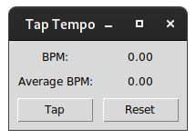

# Tap-Tempo

This is a simple Program to tap-in a tempo.  It calculates the time
between to taps in BPM as well as the average BPM of multiple taps.
It is also possible to connect a MIDI device as tapping input.  The
GUI is build with tkinter.

## Installation

The programm is available via pip: ``pip install taptempo``.

